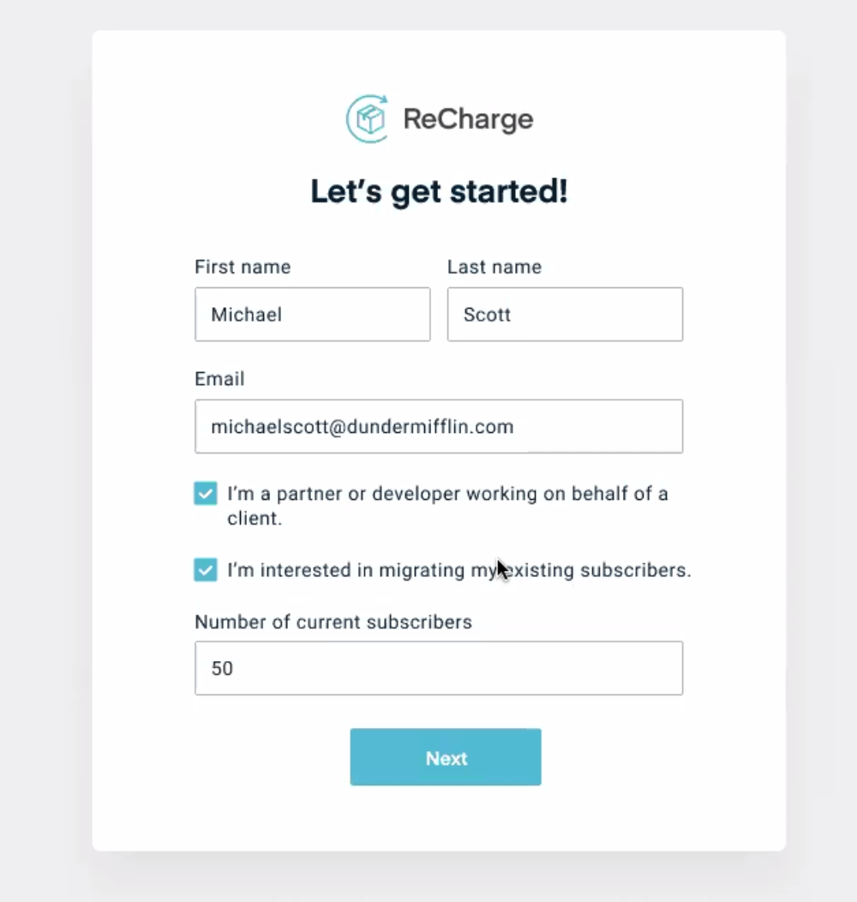

# Overview
The Recharge integration with BigCommerce lets you offer subscription and recurring billing to customers in your store. 

## Install

The BigCommerce integration works out-of-the-box and only requires you to configure general store settings. The following are the steps to install the app:

1. Install the ReCharge app from the [BigCommerce App Marketplace](https://www.bigcommerce.com/apps/). You will then fill out a form with information about your store. Once this process is complete, ReCharge will contact you with next steps.

2. You will need to provide the ReCharge team with API credentials. Follow these steps to obtain API credentials for the store:
